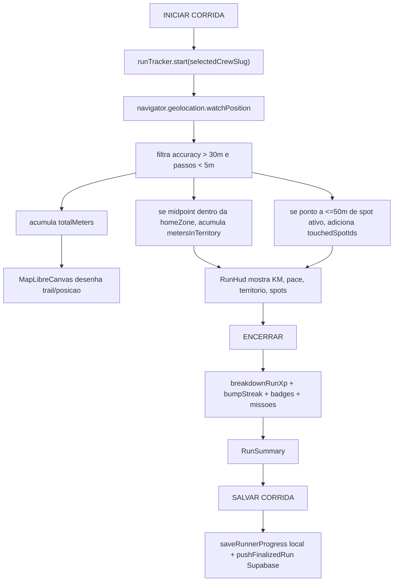

# Gamificacao no mapa 2D — estado atual

Data: 2026-06-03
Superficie publica validada: `https://crew.axialagents.com/?release=DT8CVAt9`

## Resumo executivo

O mapa 2D e o palco canonico da gamificacao. Hoje ele reflete progresso em quatro niveis:

1. Status global do runner: streak, level, XP e badge da crew no `HudOverlay`.
2. Controle de camadas: `Territorio`, `Live`, `Missoes` e `Historia` no `LayerRail`.
3. Corrida ativa: trilha GPS, posicao atual, HUD do cronometro e resumo de XP ao encerrar.
4. Territorio/zonas: tinta por zona vira ownership, que vira opacidade/cor de poligono e status nos sheets.

O que ainda nao esta completo: a camada `Historia` esta desabilitada; missoes aparecem como markers/sheets, mas a UI principal do mapa ainda nao conecta `MissionCard`/`useMissions` para aceitar ou abandonar missao; `isInvasion` esta sempre `false` no calculo de corrida; e os XP de missao sao registrados como missao completada no resumo, mas nao sao somados no `runnerProgress.xp` pelo fluxo atual.

## Modelo de dados

Fonte principal: `data/gamification.ts`.

### RunnerProgress

- `xp`: XP total persistido.
- `level`: derivado de XP ao salvar/carregar.
- `streakWeeks`: semanas mantidas.
- `freezesAvailable`: salva streak quando a janela semanal falha.
- `inkPerZone`: tinta acumulada por zona.
- `inkUpdatedAt`: base temporal para decay.
- `badgeUnlocks`: badges ja conquistadas.
- `weekKey` e `runsThisWeek`: janela semanal.
- `badgeUnlockEvents`: historico de unlock por zona.

### Constantes de jogo

- `XP_BASE_PER_KM = 10`
- `XP_TERRITORY_MULT = 2`
- `XP_SPOT_BONUS = 15`
- `XP_LOOP_MULT = 1.5`
- `XP_INVASION_MULT = 1.5`
- `INK_PER_KM = 10`
- `INK_PER_FULL_OWNERSHIP = 1000`
- `INK_DECAY_PER_DAY = 0.033`
- `INK_OWNERSHIP_CONTESTED = 0.4`
- `INK_OWNERSHIP_OWNED = 0.6`

## Fluxo de corrida



## Calculo de XP

Ao encerrar a corrida, `useRunController.stopRun()` chama `breakdownRunXp()` com:

- `distanceKm = snapshot.totalMeters / 1000`
- `kmInTerritory = snapshot.metersInTerritory / 1000`
- `spotsTouched = snapshot.touchedSpotIds.length`
- `closedLoop = snapshot.closedLoop`
- `isInvasion = false`

Formula efetiva:

```text
baseKm = distanceKm - kmInTerritory
baseXp = round(baseKm * 10)
territoryXp = round(kmInTerritory * 10 * 2)
spotXp = spotsTouched * 15
subtotal = baseXp + territoryXp + spotXp
total = round(subtotal * loopMult * invasionMult)
```

`closedLoop` ativa `loopMult = 1.5`.
`invasionMult` existe, mas hoje nao entra porque `isInvasion` esta fixo em `false`.

## Tinta, dominio e mapa

Quando a corrida encerra:

```text
ink = kmInTerritory * INK_PER_KM
inkPerZone[homeZoneId] += ink
```

No `MapStage`, a tinta passa por decay defensivo:

```text
decayedInk = applyInkDecay(inkPerZone, inkUpdatedAt, Date.now())
ownership = min(1, decayedInk[zone] / 1000)
```

Depois `MapLibreCanvas` transforma isso em GeoJSON e desenha:

- `sp-zone-fill`: cor da zona com opacidade baseada em `ownership`.
- `sp-zone-outline`: borda colorida; mais forte na zona ativa.
- `ZoneSheet`: mostra `Domínio`, `Status` e `Tinta`.

Status:

- `neutral`: abaixo de 40%
- `contested`: 40% a 59%
- `owned`: 60%+

## O que aparece no mapa 2D

### HUD superior

Componente: `HudOverlay`.

Mostra:

- streak como numero ao lado do ponto.
- `LV`.
- barra de XP do nivel atual.
- XP total.
- badge da crew selecionada.

Na producao validada agora:

```text
Mapa vivo da cidade
0
LV 1
0 XP
Territorio / Live / Missoes / Historia
CONTA ON
```

### Camadas

Componente: `LayerRail`.

- `Territorio`: poligonos, outlines, spots no zoom de zona/spot.
- `Live`: rota/sinal, markers de crew, pings de amigos.
- `Missoes`: markers `!` em zona/spot quando a camada esta ligada e o zoom nao e cidade.
- `Historia`: existe no estado, mas esta indisponivel (`history: false`).

### Durante corrida

Componentes: `RunHud`, `MapLibreCanvas`.

Mostra:

- cronometro.
- status `AO VIVO` / `PAUSADA`.
- `BUSCANDO GPS` / `GPS FIX`.
- KM total.
- pace.
- KM em territorio.
- spots tocados.
- trilha no mapa com a cor da crew.
- pin de posicao atual.

### Depois da corrida

Componente: `RunSummary`.

Mostra:

- distancia.
- tempo ativo.
- km em territorio.
- spots tocados.
- loop fechado.
- total de XP.
- breakdown: Base, Territorio, Spots.
- chips de multiplicador de loop/invasao.
- missoes completadas, quando houver.
- avisos de streak/freeze/quebra.
- toast de badge desbloqueada.

## Missoes

Definicoes atuais:

- `Spot Hunt Centro`: Vale, Republica, Luz em 48h, `+200 XP`.
- `Night Drift`: 3km entre 22h e 04h em 168h, `+150 XP`.
- `Invasao Leste`: 5km na zona East Burners em 24h, `+300 XP`.

Mecanica implementada:

- `useMissions` consegue listar disponiveis, aceitar, resolver e abandonar.
- `acceptMission` limita a 3 ativas e bloqueia duplicata.
- `resolveMissions` atualiza progresso ao encerrar corrida.
- `useRunController.stopRun()` resolve missoes ativas e mostra completadas no `RunSummary`.

Gap atual:

- O `MapStage` atual nao renderiza `MissionCard` nem chama `useMissions`.
- Logo, no mapa publico as missoes aparecem como camada visual/sheet, mas nao vi caminho principal para aceitar missao direto dali.
- O XP de missao aparece como `+XP ganhos` no componente de missao/resumo, mas o `nextProgress.xp` soma apenas `breakdown.total` da corrida. Se a intencao for missao aumentar XP real, precisa somar `missionsCompleted.reduce((sum, m) => sum + m.xpEarned, 0)`.

## Badges

Badges definidos:

- Primeira Sangue
- Madrugador
- Invasor
- Cartografo
- Maratona Urbana
- Local Legend
- Streak 12
- Solo Wolf
- Pace Setter
- Season Captain

Condicoes ativas hoje:

- primeira corrida.
- 10 runs noturnas.
- 5 invasoes, mas depende de `invasionMult > 1`, hoje bloqueado pelo `isInvasion=false`.
- tocar 11 spots unicos.
- 42km na semana.
- streak 12.
- 50km solo em territorio.

Condicoes stub:

- Local Legend.
- Pace Setter.
- Season Captain.

Reflexo no mapa:

- `BadgeUnlockToast` aparece no fechamento da corrida.
- `badgeUnlockEvents` guarda zona e horario do unlock.
- Nao ha ainda uma camada visual de "badges no mapa" ou historico de carimbos por zona.

## Persistencia e cloud

Local:

- `runnerProgressStorage`: XP, level, streak, tinta, badges.
- `activeRunStorage`: corrida em andamento.
- `storage.ts`: historico, missoes, diario.

Cloud:

- `pushFinalizedRun` sincroniza corrida finalizada para Supabase em background.
- Entidades: `runs`, `runner_progress`, `run_history_stats`, `badge_unlocks`.
- A UX e local-first: salvar local nao depende de rede.

## Diagnostico de maturidade

### Real e ativo

- GPS real.
- Distancia/tempo/pace.
- Trail no mapa 2D.
- Spot proximity.
- XP por distancia/territorio/spots/loop.
- Streak semanal.
- Tinta por zona.
- Heatmap por ownership.
- Badges principais.
- Sync final para Supabase.

### Parcial

- Missoes: dados/resolver existem; UI principal de aceite no mapa nao esta conectada.
- Invasao: multiplicador e badge existem; detector/flag real nao esta ativo.
- Leaderboard: `ZoneLeaderboard` aparece no sheet, mas depende de dados externos/servico.
- Historia: botao existe, camada desabilitada.

### Proximas ondas recomendadas

1. Conectar `MissionCard`/`useMissions` ao painel `Missoes` do mapa.
2. Decidir se `rewardXp` de missao deve somar no XP real.
3. Implementar `isInvasion` de verdade: correr fora da home zone ou em zona rival.
4. Criar camada `Historia`: trilhas salvas, badges por zona, carimbos de conquista.
5. Mostrar ownership incremental no momento do save: `+X tinta em Centro`.
6. Expor uma legenda curta: neutral/contested/owned sem poluir o mapa.
