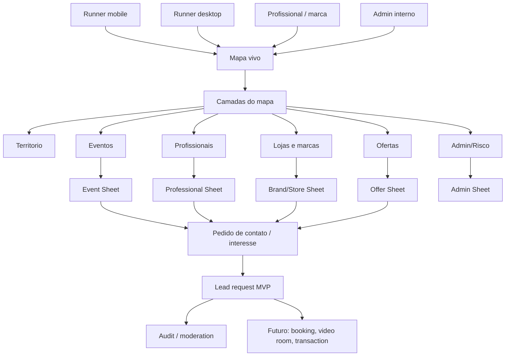
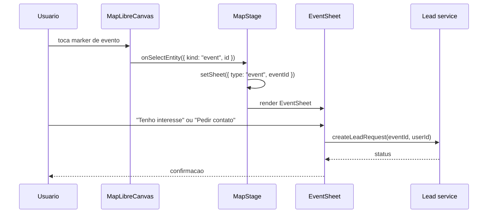
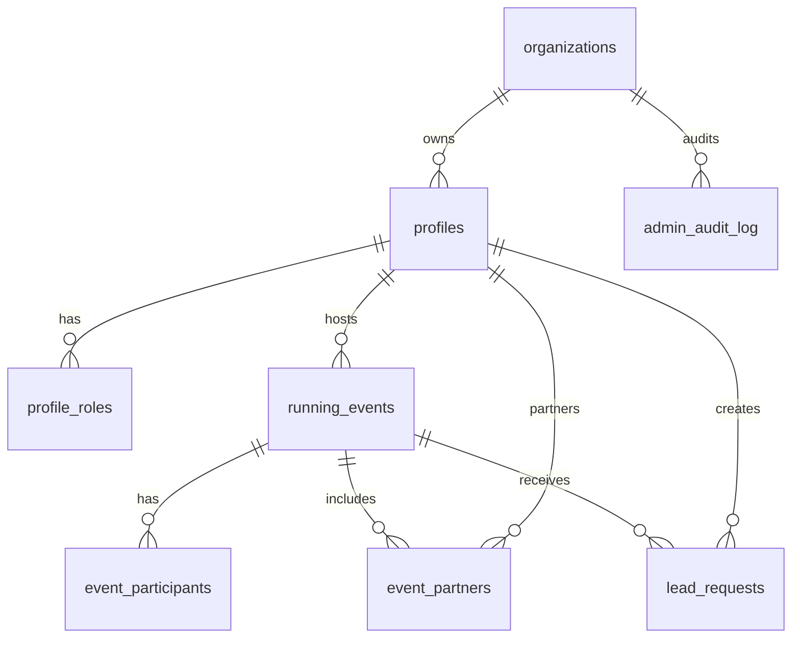

# Map-Centric Events Architecture

Data: 2026-06-04
App: `apps/crew-running`
Status: arquitetura proposta. Nenhuma implementacao feita.

## Decisao

A primeira arquitetura nova deve colocar `Eventos` como camada MVP do mapa.

Por que eventos primeiro:

- Evento faz a cidade parecer viva.
- Evento conecta runner, crew, profissional, loja, marca e sponsor sem parecer anuncio solto.
- Evento cria acao clara no front-end: tocar no mapa -> abrir sheet -> salvar/interessar/pedir contato.
- Evento prepara o caminho para pagamentos, patrocinios, booking, video rooms e publicidade por zona sem exigir isso no MVP.

## Norte do Produto

```text
Mapa central
  -> Zona
    -> Evento
      -> Host/profissional/marca
        -> Lead/contato
          -> Futuro: booking/video/pagamento/comissao
```

Mobile continua sendo corrida, GPS e jogo urbano.

Desktop vira mapa operacional/social/comercial:

- progresso e territorio;
- eventos;
- profissionais;
- marcas/lojas;
- oportunidades;
- admin/riscos;
- dados agregados.

## Sistema em Alto Nivel



## Arquitetura Front-End

O mapa atual ja tem uma boa divisao:

- `MapStage.tsx`: orquestra estado, camadas, sheets e acoes.
- `MapLibreCanvas.tsx`: renderiza mapa e entidades clicaveis.
- `LayerRail.tsx`: liga/desliga camadas.
- `mapLayerStorage.ts`: persiste preferencia de camadas.
- `mapTypes.ts`: contrato de estado do mapa.
- `ZoneSheet.tsx`, `SpotSheet.tsx`, `CrewSheet.tsx`: sheets atuais.
- `data/spLiveMap.ts` e `data/spGeoJSON.ts`: zonas/spots/base geografica.

Nova arquitetura proposta:

```text
data/mapEvents.ts
  fixtures/tipos MVP de eventos

data/mapEntities.ts
  tipo comum para entidades clicaveis do mapa

components/map/EventLayer.tsx ou render em MapLibreCanvas
  markers de eventos

components/map/EventSheet.tsx
  detalhes e acoes do evento

components/map/MapEntitySheet.tsx (futuro)
  roteia evento/profissional/marca/oferta

services/mapLeadStorage.ts ou future cloud table
  pedido de contato MVP local/cloud
```

### Extensao do estado de camada

Hoje:

```ts
type MapLayerState = {
  territory: boolean;
  live: boolean;
  missions: boolean;
  history: boolean;
}
```

Proposto para Onda 1:

```ts
type MapLayerState = {
  territory: boolean;
  live: boolean;
  missions: boolean;
  history: boolean;
  events: boolean;
}
```

Futuro:

```ts
type MapLayerState = {
  territory: boolean;
  live: boolean;
  missions: boolean;
  history: boolean;
  events: boolean;
  professionals: boolean;
  brands: boolean;
  offers: boolean;
  adminRisk: boolean;
}
```

## Entidade Clicavel do Mapa

Para nao criar uma camada diferente demais para cada coisa, usar um contrato comum.

```ts
type MapEntityKind =
  | 'event'
  | 'professional'
  | 'brand'
  | 'store'
  | 'offer'
  | 'athlete';

type MapEntity = {
  id: string;
  kind: MapEntityKind;
  title: string;
  subtitle?: string;
  zoneId?: string;
  crewSlug?: string;
  lng: number;
  lat: number;
  tags: string[];
  status: 'draft' | 'pending' | 'active' | 'flagged' | 'archived';
  visibility: 'public' | 'crew' | 'private' | 'admin';
  sponsorLabel?: 'none' | 'sponsored' | 'partner' | 'publi';
}
```

Eventos usam esse contrato, mas tambem tem dados proprios.

```ts
type RunningEvent = {
  id: string;
  title: string;
  eventType:
    | 'crew-run'
    | 'training'
    | 'race'
    | 'run-party'
    | 'store-activation'
    | 'workshop'
    | 'challenge';
  startsAt: string;
  endsAt?: string;
  zoneId: string;
  spotId?: string;
  hostProfileId: string;
  hostType: 'runner' | 'coach' | 'store' | 'brand' | 'club' | 'event_creator';
  crewSlugs: string[];
  tags: string[];
  capacity?: number;
  locationMode: 'map-point' | 'zone-only' | 'online' | 'hybrid';
  locationLabel?: string;
  lng?: number;
  lat?: number;
  verificationStatus: 'unverified' | 'verified' | 'trusted';
  moderationStatus: 'pending' | 'approved' | 'rejected' | 'flagged';
  commercialStatus: 'community' | 'sponsored' | 'partner';
  ctaMode: 'interest' | 'external-link' | 'contact-request';
}
```

## Fluxo de Clique



## Sheets

### Zone Sheet

O `ZoneSheet` deve virar o agregador local.

MVP:

- dominio da crew;
- tinta/ownership;
- eventos ativos da zona;
- profissionais relacionados aos eventos;
- lojas/marcas relacionadas aos eventos;
- CTA: `Ver eventos da zona`.

Futuro:

- ofertas;
- campanhas;
- atletas com opt-in;
- analytics agregados;
- compra de midia por zona.

### Event Sheet

MVP:

- titulo;
- tipo;
- host;
- zona/local;
- data/hora;
- crews relacionadas;
- tags;
- verificacao;
- label comercial se houver;
- acoes: `Salvar`, `Tenho interesse`, `Pedir contato`, `Reportar`.

Futuro:

- `Inscrever`;
- `Comprar ingresso`;
- `Entrar na sala`;
- `Usar cupom`;
- `Convidar crew`.

### Professional Sheet

Nao precisa ser primeira camada isolada. No MVP, profissional aparece dentro do evento como host/parceiro.

MVP:

- handle;
- role/tags;
- verificacao;
- zona de atendimento;
- eventos hospedados;
- CTA de contato.

### Brand/Store Sheet

No MVP, loja/marca aparece como host/patrocinador/parceiro de evento.

MVP:

- handle/nome;
- local;
- eventos;
- oferta simples;
- label comercial;
- CTA de contato.

## Backend e Dados

### MVP Local/Fixture

Para validar UX sem abrir schema grande:

```text
data/mapEvents.ts
data/mapPartners.ts
data/mapProfessionals.ts
```

Pragmaticamente:

- usar fixtures controlados;
- sem pagamento;
- sem lead real se ainda nao houver backend;
- simular `Tenho interesse` localmente ou em tabela simples depois.

### Supabase MVP

Quando sair de fixture:



Tabelas Onda 1/2:

```text
profiles
profile_roles
running_events
event_partners
event_interest
lead_requests
moderation_reports
admin_audit_log
```

Tabelas Futuro:

```text
bookings
video_rooms
transactions
transaction_commissions
ad_campaigns
map_promotions
sponsorship_offers
partner_offers
```

## RLS e Privacidade

Regras:

- Dados publicos do evento podem ser lidos por usuarios autenticados.
- Dados de lead/contact so aparecem para criador do lead, host autorizado e admin.
- Dados de atleta para marca usam agregados e opt-in.
- Rota GPS bruta nunca alimenta discovery comercial.
- Profissionais de saude precisam de verificacao antes de destaque.
- Conteudo patrocinado precisa de label.
- Toda acao admin ou sensivel grava audit log.

Padrao:

```text
public map data -> read authenticated
private contact data -> owner/host/admin only
admin actions -> Edge Function + membership + audit
transactions future -> server only
```

## Actions e Permissoes

### Runner

- ver evento;
- salvar evento;
- demonstrar interesse;
- pedir contato;
- reportar evento/perfil;
- futuro: pagar, agendar, entrar em sala.

### Host profissional/marca

- criar evento;
- editar evento proprio;
- ver leads do proprio evento;
- responder lead;
- futuro: criar oferta, agenda, video, cobranca.

### Admin

- aprovar/rejeitar evento;
- verificar perfil;
- ocultar destaque;
- ver reports;
- auditar leads;
- futuro: aprovar campanha/publicidade/transacao.

## Produto: Tela Inicial Desktop

Desktop deve abrir em uma composicao assim:

```text
Top bar
  Busca por zona/evento/@handle
  Perfil
  Ambiente

Mapa central
  Camadas: Territorio / Eventos / Profissionais / Marcas / Ofertas
  Markers contextuais
  Heat/ownership

Right sheet / bottom sheet
  Zona, evento ou perfil selecionado

Side rail
  Filtros e legenda
  Meus eventos salvos
  Pedidos de contato
```

No mobile, manter foco em corrida:

```text
Mapa vivo
  Territorio / Live / Missoes
  Eventos aparecem como contexto leve, nao como shopping
```

## O Que Implementar Primeiro Quando For Autorizado

Onda tecnica minima:

1. Adicionar `events` em `MapLayerState`.
2. Criar `data/mapEvents.ts` com 5 a 8 eventos fixture.
3. Renderizar markers de eventos em `MapLibreCanvas`.
4. Adicionar `EventSheet`.
5. Conectar `onSelectEvent` em `MapStage`.
6. Adicionar CTA local `Tenho interesse`.
7. Atualizar testes de camada e smoke visual.

Sem Supabase novo ainda, se o objetivo for validar UX.

Se o objetivo for validar operacao real:

1. Criar `running_events`.
2. Criar `event_interest` ou `lead_requests`.
3. Criar RLS basica.
4. Criar admin read-only.

## Decisao de Arquitetura Recomendada

Recomendacao:

- Arquitetura de mapa por camadas.
- Primeiro dominio novo: `Eventos`.
- Profissionais e marcas entram como hosts/parceiros de eventos, nao como camada solta no primeiro MVP.
- Lead/contact e o primeiro "quase-commerce".
- Checkout/video/booking entram depois, mas o schema ja deve deixar o caminho limpo.

Esta abordagem evita construir marketplace cedo demais e ainda prova a tese principal: o mapa gera relacao, relacao gera lead, lead vira transacao futura.
