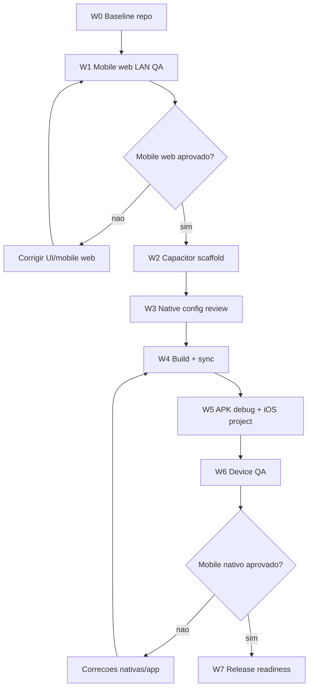

# Plano de orquestracao e execucao - Mobile test, Android APK e iOS export

Data: 2026-06-03
App: `apps/crew-running`
Output alvo inicial de teste Android: `apps/crew-running/android/app/build/outputs/apk/debug/app-debug.apk`
Output alvo iOS: projeto Xcode em `apps/crew-running/ios/App`
Estrategia: validar mobile web primeiro, depois empacotar o build Vite/PWA com Capacitor para Android e iOS. O APK debug Android e o primeiro artefato local de QA, nao o escopo completo da exportacao mobile.

## Clarificacao 2026-06-06

- Android APK debug continua sendo o primeiro artefato local de QA.
- iOS tambem faz parte do plano de exportacao do produto. O caminho esperado e
  Capacitor Android + Capacitor iOS a partir do mesmo app Vite/React/PWA.
- Nao tratar este plano como exclusivo de Android; o projeto Xcode/iOS precisa
  ser criado e validado antes de qualquer promessa de release cross-platform.
- Background tracking real nao fica resolvido apenas por WebView. Se corrida
  longa com tela bloqueada virar requisito, planejar ponte nativa: Android
  foreground service e iOS CoreLocation background.

## Objetivo da onda

Criar um caminho repetivel para:

- testar a experiencia mobile em aparelho real pela rede local;
- confirmar que o build de producao mobile carrega corretamente;
- adicionar wrappers Android e iOS via Capacitor;
- gerar um APK debug instalavel para QA interno;
- deixar claro o que ainda falta antes de release assinado, Play Store ou App Store.

## Nao escopo

- Nao reescrever o app em React Native.
- Nao mexer no runner creator, no contrato de geracao ou nos assets de crews.
- Nao restaurar `StylePicker`, `data/styles.ts`, `public/styles/*`, slot `hair`, `crew-flow` ou `Crew Flow`.
- Nao colocar secrets, Supabase service role, keystore, senha ou token em `VITE_*`, repo, bundle Android, bundle iOS ou localStorage.
- Nao publicar na Play Store ou App Store nesta onda.
- Nao tratar o APK debug ou o projeto iOS inicial como build final para cliente.

## Estado atual de entrada

- O app principal desta esteira e `apps/crew-running`.
- O projeto e Vite/React com PWA via `vite-plugin-pwa`.
- O manifesto PWA ja define `name`, `short_name`, `display: standalone`, `orientation: portrait`, icons e assets de marca.
- Nao ha projeto `android/`, `ios/`, `capacitor.config.*`, `app.json`, `eas.json` ou Expo detectado no app.
- O teste LAN atual pode usar IP local `192.168.15.5`, mas esse IP deve ser rechecado a cada sessao.

## Regras de execucao

1. Validar mobile web antes de criar APK ou projeto iOS.
2. Trabalhar por ondas pequenas e registrar achados antes de mudar a camada nativa.
3. Rodar `npm run validate` antes de tratar o APK como candidato de teste.
4. Preservar qualquer mudanca preexistente fora do escopo.
5. Nao alterar o runner creator para resolver problema de empacotamento nativo.
6. Manter `TESTAR LOCAL` disponivel durante e depois do empacotamento.
7. Separar claramente APK debug, APK release, AAB de publicacao e build/archive iOS.
8. Se GPS, camera ou upload falharem so no wrapper nativo, corrigir permissao/plugin nativo em uma onda propria.

## Task graph



## Papeis de orquestracao

### Condutor da onda

Responsavel por manter a sequencia, decidir se uma onda passa ou volta, e fechar o status final.

Entregas:

- checklist de entrada;
- decisao de avance/bloqueio por onda;
- lista de riscos restantes.

### Guardiao do contrato do app

Responsavel por impedir que o empacotamento nativo quebre regras centrais do produto.

Checagens obrigatorias:

- creator continua travado pela crew selecionada;
- `TESTAR LOCAL` continua presente;
- `public/styles/*` nao vira input de geracao;
- runner types continuam canonicos: `sprint`, `long-run`, `night-run`, `crew-pace`, `urban-trail`.

### Empacotador nativo

Responsavel por Capacitor, Android Studio/Gradle, APK debug, Xcode/iOS project e logs do aparelho.

Entregas:

- `capacitor.config.*`;
- pasta `android/`;
- pasta `ios/`;
- APK debug;
- projeto iOS abrindo no Xcode;
- path final do APK;
- comandos de reproducao.

### QA de aparelho real

Responsavel por testar em aparelho fisico, nao apenas no browser desktop responsivo.

Checagens obrigatorias:

- boot frio;
- onboarding;
- selecao de crew;
- creator;
- mapa/GPS;
- audio/assets;
- login/sync quando aplicavel;
- retorno ao app apos background.

## Arquivos esperados

Arquivos novos provaveis:

```text
apps/crew-running/capacitor.config.ts
apps/crew-running/android/**
apps/crew-running/ios/**
```

Arquivos alterados provaveis:

```text
apps/crew-running/package.json
apps/crew-running/package-lock.json
```

Artefato gerado:

```text
apps/crew-running/android/app/build/outputs/apk/debug/app-debug.apk
apps/crew-running/ios/App
```

## Onda W0 - Baseline repo

Objetivo: confirmar que o app atual passa sem camada nativa antes de empacotar.

Comandos:

```bash
cd "/Users/belissima/Desktop/running crew/apps/crew-running"
npm run validate
```

Saida esperada:

- contrato do creator passa;
- typecheck passa;
- testes passam;
- build passa;
- smoke do creator passa.

Criterio de aceite:

- nenhuma alteracao de codigo necessaria para fechar baseline;
- se falhar, registrar o erro exato e corrigir antes de seguir para APK ou iOS.

## Onda W1 - Mobile web LAN QA

Objetivo: testar o app em aparelho real antes de envolver Android/iOS.

Comandos:

```bash
cd "/Users/belissima/Desktop/running crew/apps/crew-running"
ipconfig getifaddr en0 || ipconfig getifaddr en1
VITE_DEV_HOST=lan npm run dev
```

Abrir no celular, na mesma rede Wi-Fi:

```text
http://<IP_DA_MAQUINA>:3100
```

Checklist:

- app abre sem tela branca;
- layout mobile nao estoura largura;
- onboarding e selecao de crew funcionam;
- creator abre e salva estado local;
- `TESTAR LOCAL` esta visivel e funcional;
- mapa carrega tiles;
- GPS pede permissao quando acionado;
- audio e imagens principais carregam;
- voltar/background nao perde estado critico.

Criterio de aceite:

- fluxo principal usavel no celular;
- falhas restantes classificadas como bloqueadoras ou nao bloqueadoras antes de criar APK ou projeto iOS.

## Onda W2 - Capacitor scaffold

Objetivo: criar a camada Capacitor Android/iOS como wrapper do build Vite.

Comandos:

```bash
cd "/Users/belissima/Desktop/running crew/apps/crew-running"
npm i @capacitor/core @capacitor/android @capacitor/ios
npm i -D @capacitor/cli
npx cap init "The Crew Running" "com.thecrewrunning.app" --web-dir=dist
npm run build
npx cap add android
npx cap add ios
npx cap sync
```

Decisoes a confirmar:

- `appId`: `com.thecrewrunning.app` e provisorio ate definicao final de dominio/pacote.
- `appName`: `The Crew Running`.
- `webDir`: `dist`.
- `bundledWebRuntime`: nao adicionar.

Criterio de aceite:

- `capacitor.config.ts` existe e aponta para `dist`;
- `android/` existe;
- `ios/` existe;
- `npx cap sync` conclui sem erro para Android e iOS.

## Onda W3 - Native config review

Objetivo: revisar configuracao nativa antes do primeiro APK e do primeiro projeto iOS.

Checagens:

- `android/app/src/main/AndroidManifest.xml` nao tem permissoes desnecessarias;
- `ios/App/App/Info.plist` nao tem permissoes desnecessarias;
- se GPS precisar funcionar no APK, mapear permissao de location e decidir se entra `@capacitor/geolocation`;
- se GPS precisar funcionar no iOS, mapear permissao de location e decidir se entra `@capacitor/geolocation`;
- se upload/camera precisar funcionar no wrapper nativo, mapear permissao/plugin em onda propria;
- nome do app aparece corretamente;
- package/bundle id nao conflita com app instalado;
- icons/splash podem usar `public/icons/icon-512.png` e `public/brand/splash.png`, mas isso nao bloqueia o primeiro debug APK nem o primeiro projeto iOS.

Opcional depois do primeiro APK:

```bash
npm i -D @capacitor/assets
npx capacitor-assets generate
```

Criterio de aceite:

- nenhum segredo ou chave privada entrou no Android/iOS;
- permissoes estao explicitas e justificadas;
- app ainda compila depois do review.

## Onda W4 - Build e sync final

Objetivo: gerar o build web que sera embarcado nos wrappers nativos.

Comandos:

```bash
cd "/Users/belissima/Desktop/running crew/apps/crew-running"
npm run validate
npm run build
npx cap sync android
npx cap sync ios
```

Criterio de aceite:

- `dist/` atualizado;
- validacao completa passou;
- Android e iOS receberam os assets novos via sync.

## Onda W5 - APK debug + iOS project

Objetivo: gerar o APK instalavel de teste e confirmar que o projeto iOS abre no Xcode.

Comandos:

```bash
cd "/Users/belissima/Desktop/running crew/apps/crew-running/android"
./gradlew assembleDebug
```

Output esperado:

```text
/Users/belissima/Desktop/running crew/apps/crew-running/android/app/build/outputs/apk/debug/app-debug.apk
/Users/belissima/Desktop/running crew/apps/crew-running/ios/App
```

Instalacao via USB:

```bash
adb devices
adb install -r app/build/outputs/apk/debug/app-debug.apk
```

Criterio de aceite:

- APK instala em aparelho Android;
- projeto iOS abre no Xcode;
- app abre;
- nao ha crash imediato;
- path final do APK e path do projeto iOS foram registrados.

## Onda W6 - Device QA nativo

Objetivo: validar comportamento real dentro do WebView Android e WKWebView iOS.

Comandos uteis:

```bash
adb logcat | rg -i "capacitor|chromium|crew|fatal|exception|error"
```

Checklist nativo:

- boot frio sem tela branca;
- assets locais aparecem no APK e no projeto iOS;
- rotas internas funcionam ao recarregar;
- onboarding e selecao de crew funcionam;
- creator funciona sem quebrar contrato;
- mapa carrega e nao bloqueia a UI;
- GPS pede permissao e retorna resultado aceitavel;
- login/sync funcionam se ambiente estiver configurado;
- app volta corretamente do background;
- performance nao fica travada em aparelho intermediario.

Criterio de aceite:

- nenhuma falha bloqueadora no fluxo principal;
- falhas nao bloqueadoras documentadas com tela, log e passo de reproducao.

## Onda W7 - Release readiness

Objetivo: preparar o caminho para teste fechado ou release, sem misturar com debug APK ou projeto iOS inicial.

Pendencias antes de release:

- definir package id Android definitivo;
- definir bundle id iOS definitivo;
- gerar icones/splash nativos finais;
- criar keystore fora do repo;
- configurar assinatura release;
- decidir APK release versus AAB;
- preparar certificados/profiles iOS fora do repo;
- decidir TestFlight/App Store Connect;
- validar politicas de privacidade se GPS/login/sync forem publicos;
- testar install fresh e upgrade install;
- documentar versao, hash/commit e data do build.

Comandos futuros, depois da assinatura:

```bash
cd "/Users/belissima/Desktop/running crew/apps/crew-running/android"
./gradlew assembleRelease
./gradlew bundleRelease
```

Criterio de aceite:

- debug APK aprovado em aparelho real;
- projeto iOS validado no Xcode e pronto para device QA/TestFlight em onda propria;
- riscos de permissao, privacidade e assinatura mapeados;
- proxima onda pode focar em release assinado sem reabrir o empacotamento basico.

## Plano de rollback

Se o scaffold nativo atrapalhar o repo antes de aprovado:

- remover apenas os arquivos criados nesta onda;
- preservar alteracoes preexistentes;
- voltar para o teste mobile web via LAN;
- registrar o erro que motivou rollback.

Arquivos provaveis de rollback:

```text
apps/crew-running/capacitor.config.ts
apps/crew-running/android/**
apps/crew-running/ios/**
```

`package.json` e `package-lock.json` so devem remover dependencias Capacitor se a decisao for abandonar Android/iOS nesta esteira.

## Criterio final de pronto para teste interno

O app esta pronto para teste interno mobile nativo quando:

- `npm run validate` passa;
- mobile web LAN passa no aparelho;
- `npx cap sync` passa para Android e iOS;
- `./gradlew assembleDebug` gera APK;
- APK instala e abre em Android fisico;
- projeto iOS abre no Xcode;
- checklist de device QA nao tem bloqueador;
- path do APK, path do projeto iOS e comandos de reproducao estao documentados.
