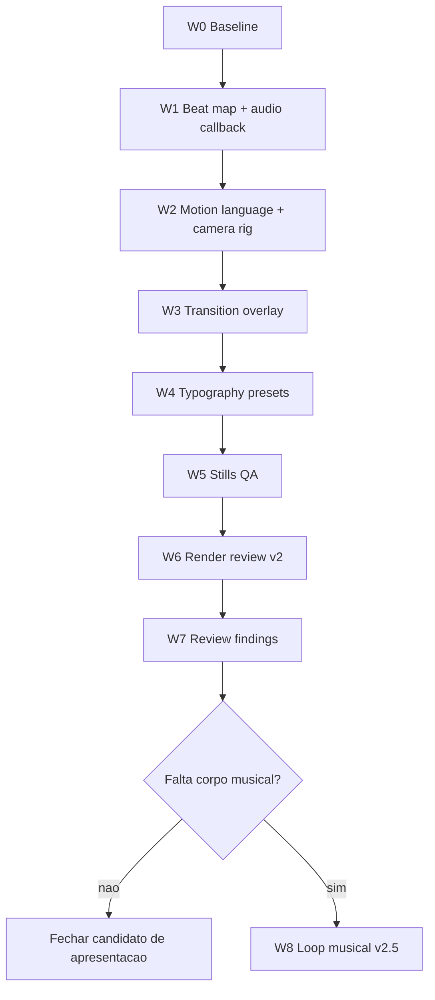

# Plano de orquestracao e execucao - Remotion review v2

Data: 2026-06-03
Escopo principal: `apps/crew-running-video`
Escopo documental: `apps/crew-running/vault`
Composicao: `EstamosChegando`
Output alvo: `apps/crew-running-video/out/estamos-chegando-review-v2.mp4`

## Objetivo da onda

Gerar um review v2 do video "Estamos Chegando" com:

- audio, cortes, texto e camera guiados por um beat map;
- camera com presets por cena, nao Ken Burns linear;
- transicoes materiais e gritty, sem glow limpo;
- tipografia com coreografia propria por cena;
- render de 30s pronto para revisao, mas ainda nao tratado como master final.

## Nao escopo

- Nao mexer no runner creator.
- Nao mexer em Gemini/API de geracao de personagem.
- Nao restaurar estilo antigo, `StylePicker`, `public/styles/*` ou slot `hair`.
- Nao renderizar master final sem aprovacao explicita.
- Nao trocar Remotion por HyperFrames no corte principal.
- Nao adicionar CSS animation/transition, `gsap.to()`, ticker ou animacao dependente de tempo real.

## Estado atual de entrada

- Draft renderizado: `apps/crew-running-video/out/estamos-chegando-review.mp4`
- Duracao medida: aproximadamente 30.06s.
- Aviso tecnico conhecido: Remotion alertou sobre volume dinamico passado como numero por frame.
- Planos de base:
  - `apps/crew-running/vault/2026-06-03-remotion-audio-beatmap-plan.md`
  - `apps/crew-running/vault/2026-06-03-remotion-motion-typography-transition-plan.md`

## Regras de execucao

1. Trabalhar por ondas pequenas.
2. Rodar typecheck depois de cada onda de codigo.
3. Gerar stills antes de render longo.
4. Corrigir apenas arquivos do pacote de video e docs da onda.
5. Preservar qualquer mudanca preexistente fora do escopo.
6. Se uma mudanca visual piorar legibilidade, reverter somente a mudanca da propria onda.
7. Manter todos os calculos frame-safe: `useCurrentFrame()`, `useVideoConfig()`, `interpolate()` e helpers deterministas.

## Arquivos esperados

Arquivos novos:

```text
apps/crew-running-video/src/data/beatMap.ts
apps/crew-running-video/src/data/motionLanguage.ts
apps/crew-running-video/src/scenes/TransitionOverlay.tsx
```

Arquivos alterados:

```text
apps/crew-running-video/src/scenes/AudioTracks.tsx
apps/crew-running-video/src/scenes/StoryboardScene.tsx
apps/crew-running-video/src/compositions/EstamosChegando.tsx
apps/crew-running-video/package.json
```

`package.json` so deve mudar se adicionarmos scripts de QA ou render. Evitar novas dependencias nesta onda.

## Task graph



## Onda W0 - Baseline e protecao

Objetivo: confirmar que estamos partindo do draft correto e que o pacote compila antes de mexer.

Comandos:

```bash
cd "apps/crew-running-video"
npm run sync-assets
npm run typecheck
```

Checagens:

- `out/estamos-chegando-review.mp4` existe.
- `src/data/timeline.ts` continua com 900 frames totais.
- `EstamosChegando` continua sendo a composicao publica principal.

Saida esperada:

- Nenhuma alteracao de codigo.
- Baseline tecnico confirmado.

## Onda W1 - Beat map e audio callback

Objetivo: criar a fonte unica de ritmo e remover o warning de volume dinamico.

Implementar:

- `src/data/beatMap.ts`
  - `FPS = 30`
  - `BPM = 120`
  - `sec(value)`
  - `beat(value)`
  - eventos principais por tempo/frame
  - nomes de hits: `lockOn`, `equipSnap`, `navSlab`, `stampSave`, `tapAlt`

- `src/scenes/AudioTracks.tsx`
  - trocar `volume={number}` dinamico por `volume={(f) => ...}`;
  - converter frame local do audio para frame global quando necessario;
  - aplicar ducking ao redor dos hits;
  - alinhar hit de 17.0s e acento de 18.5s;
  - manter volumes conservadores.

Critico:

- O callback de volume recebe frame local do audio. Se o audio comecar em uma `Sequence`, somar o offset quando a curva depender do tempo global.

Validacao:

```bash
npm run typecheck
```

Criterio de aceite:

- Typecheck passa.
- Render posterior nao deve mostrar o warning de volume dinamico.

## Onda W2 - Motion language e camera rig

Objetivo: substituir camera linear por presets dirigidos por cena.

Implementar:

- `src/data/motionLanguage.ts`
  - preset de camera por `scene.id`;
  - preset de tipo por `scene.id`;
  - preset de transicao de saida;
  - frames de impacto derivados do beat map.

- `src/scenes/StoryboardScene.tsx`
  - extrair `cameraRig(scene, frame)`;
  - retornar `scale`, `x`, `y`, `rotate`, `jitterX`, `jitterY`;
  - usar jolt curto nos frames de impacto;
  - manter transform leve o bastante para nao cortar rostos ou elementos principais.

Camera presets:

| Cena | Preset | Intencao |
| --- | --- | --- |
| `coldBoot` | `coldPushScan` | cidade acorda, push lento e scan vertical |
| `signalOpen` | `ticketSettle` | cartaz/sinal assenta na tela |
| `crewRitual` | `posterDrift` | presenca de grupo com drift controlado |
| `streetMovement` | `impactDiagonal` | corte fisico, entrada diagonal e jolt |
| `crewFormation` | `lateralTrack` | tracking de corrida, mais decisao lateral |
| `territoryMarked` | `mapPullStamp` | mapa puxa e reage ao stamp |
| `cityReady` | `finalBreath` | respiro quase parado para assinatura |

Validacao:

```bash
npm run typecheck
npm run stills:qa
```

Criterio de aceite:

- Stills continuam legiveis.
- Movimento nao vira shake constante.
- Final fica mais calmo que o meio.

## Onda W3 - Transition overlay

Objetivo: dar linguagem aos cortes sem mudar a duracao da composicao.

Implementar:

- `src/scenes/TransitionOverlay.tsx`
  - receber `frame` global;
  - desenhar slabs, blackout, scratch, wipe e flashes sujos;
  - usar `staticFile('textures/board.png')` quando precisar de materialidade;
  - nunca usar glow neon ou blur limpo.

- `src/compositions/EstamosChegando.tsx`
  - renderizar `<TransitionOverlay frame={frame} />` acima da cena.

Transicoes:

| Tempo | Frame | Nome | Direcao |
| --- | ---: | --- | --- |
| 4.0s | 120 | `lockOnSlab` | faixa preta/acento atravessa tela |
| 8.0s | 240 | `paperTear` | wipe irregular escuro |
| 13.0s | 390 | `streetSmash` | 2 frames de preto + slab laranja |
| 17.0s | 510 | `matchTrack` | smear lateral seco |
| 22.0s | 660 | `stampPress` | pressao/sombra dura |
| 26.0s | 780 | `dirtyBlackout` | quase preto antes do lockup |

Validacao:

```bash
npm run typecheck
npm run stills:qa
```

Criterio de aceite:

- Corte de 13s e 22s devem ser os maiores impactos.
- Transicoes nao podem esconder texto por tempo demais.
- A tela final precisa respirar depois do blackout.

## Onda W4 - Tipografia por preset

Objetivo: tirar a sensacao de legenda unica e fazer a tipografia virar objeto do mundo visual.

Implementar em `StoryboardScene.tsx`:

- manter `CopyBlock`, mas dividir a logica por `typePreset`;
- variar backing plate, rule, entrada de kicker e entrada de headline;
- aplicar textura tambem sobre o texto;
- manter no maximo duas pancadas de headline por cena;
- preservar Bowlby como headline principal e Anton como comando.

Type presets:

| Cena | Preset | Tratamento |
| --- | --- | --- |
| `coldBoot` | `chalkSlab` | texto como tinta seca no asfalto |
| `signalOpen` | `ticketPunch` | pergunta em duas pancadas |
| `crewRitual` | `ritualPoster` | poster colado, menos UI |
| `streetMovement` | `stencilPunch` | entrada seca e agressiva |
| `crewFormation` | `inventoryLock` | linguagem de item salvo/equipado |
| `territoryMarked` | `mapStamp` | reage ao stamp |
| `cityReady` | `brandLockup` | assinatura com respiro |

Validacao:

```bash
npm run typecheck
npm run stills:qa
```

Criterio de aceite:

- Nenhum texto estoura largura.
- Nenhum texto cobre o assunto principal da cena.
- Cada cena tem sensacao propria sem perder a identidade visual.

## Onda W5 - QA de stills

Objetivo: aprovar composicao e legibilidade antes de render longo.

Comando:

```bash
npm run stills:qa
```

Frames de leitura:

| Frame | Tempo | Pergunta |
| ---: | ---: | --- |
| 45 | 1.5s | o boot criou expectativa? |
| 165 | 5.5s | a chamada da rua le em 1 segundo? |
| 285 | 9.5s | crew ritual tem presenca? |
| 430 | 14.3s | movimento parece fisico? |
| 560 | 18.6s | identidade salva nao estoura? |
| 705 | 23.5s | territorio/mapa tem impacto? |
| 830 | 27.6s | final respira e marca? |

Se falhar:

- corrigir primeiro posicionamento e escala;
- depois reduzir motion;
- por ultimo cortar copy, se necessario.

## Onda W6 - Render review v2

Objetivo: gerar o arquivo de revisao.

Comando:

```bash
npm run sync-assets
npm run typecheck
npx remotion render src/index.ts EstamosChegando out/estamos-chegando-review-v2.mp4 --codec=h264 --pixel-format=yuv420p
```

Verificacao:

```bash
ls -lh out/estamos-chegando-review-v2.mp4
ffprobe -v error -show_entries format=duration,size -of default=noprint_wrappers=1 out/estamos-chegando-review-v2.mp4
```

Criterio de aceite:

- Video renderiza completo.
- Duracao fica por volta de 30s.
- Sem warning relevante de volume dinamico.
- Arquivo abre no in-app browser/preview local.

## Onda W7 - Review findings

Objetivo: revisar como filme, nao como codigo.

Checklist:

- O video ainda parece The Crew Running?
- O primeiro impacto acontece cedo o bastante?
- A cena de rua e mais fisica que o restante?
- O trecho de identidade parece game/inventory, nao dashboard SaaS?
- O mapa/territorio tem peso de conquista?
- O final `EM BREVE / THE CREW / RUNNING` fica na memoria?
- O som guia o corte ou apenas acompanha?

Saida:

- Lista curta de findings.
- Decisao: aprovar v2 como candidato ou abrir v2.5.

## Onda W8 - Loop musical v2.5, somente se necessario

Gatilho: se o v2 tiver motion bom, mas ainda faltar corpo musical.

Direcao do loop:

- 120 BPM ou 122 BPM, half-time.
- Percussao seca, baixo sujo, textura de asfalto.
- Sem vocal.
- Sem melodia chamativa.
- Sem clima cyberpunk/neon.
- Deve entrar entre 8s e 26s e cair no final.

Antes de usar:

- confirmar origem/licenca do asset;
- salvar em `apps/crew-running-video/public/audio/music/`;
- documentar no vault.

## Criterio final da onda

A onda so esta concluida quando existir:

- `out/estamos-chegando-review-v2.mp4`;
- typecheck aprovado;
- stills QA gerados;
- duracao/tamanho verificados;
- resumo de findings do v2;
- decisao clara entre "seguir para master" ou "abrir v2.5".

## Comando rapido de execucao completa

Usar apenas depois que as ondas de codigo estiverem implementadas:

```bash
cd "apps/crew-running-video"
npm run sync-assets
npm run typecheck
npm run stills:qa
npx remotion render src/index.ts EstamosChegando out/estamos-chegando-review-v2.mp4 --codec=h264 --pixel-format=yuv420p
ffprobe -v error -show_entries format=duration,size -of default=noprint_wrappers=1 out/estamos-chegando-review-v2.mp4
```

## Proxima acao recomendada

Comecar pela W1. Ela e pequena, remove o warning tecnico e cria a base que vai guiar camera, transicoes e tipografia. Depois disso a W2 e W3 ja podem ser implementadas sem discutir timing de novo.
